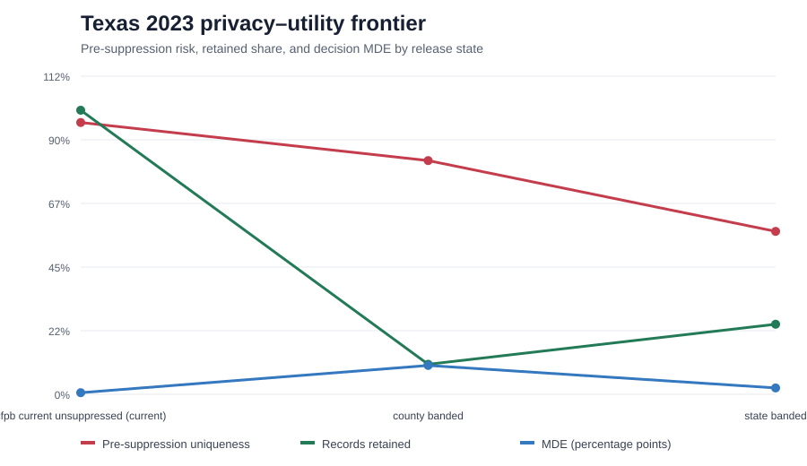
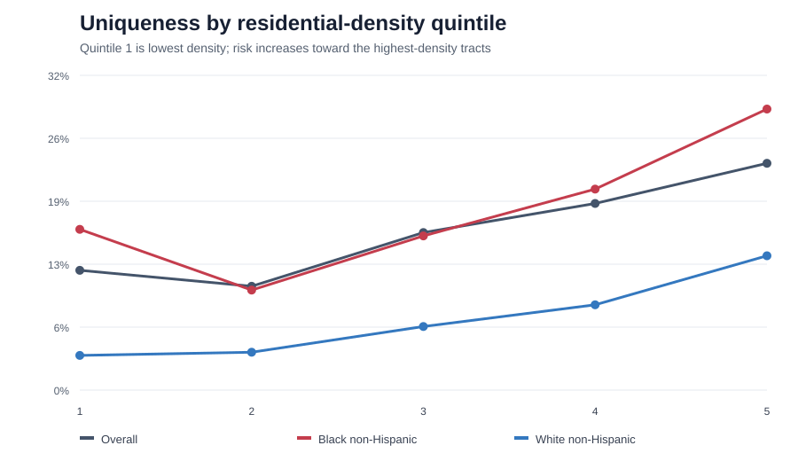

# HMDA Disclosure Risk & Governance Platform

This project measures how much re-identification risk remains in publicly released Home Mortgage Disclosure Act (HMDA) data and what stronger privacy protection would cost in fair-lending analytical utility.

## Ethical guardrails — read before writing or running code

This project measures re-identification risk on real people's mortgage records. The boundary between privacy engineering and doxxing is a design decision.

### Permitted

- Measure uniqueness, equivalence-class sizes, k-anonymity distributions, and population-uniqueness estimates.
- Model linkage risk theoretically.
- Simulate linkage only against synthetic auxiliary data generated from aggregate marginal distributions.
- Report results only in aggregate and suppress small cells.

### Prohibited

- Obtaining or using identified auxiliary data such as voter files, property-owner records, or marketing lists.
- Attempting to identify an applicant or borrower.
- Publishing a record or field combination that narrows to a person.
- Exporting row-level high-risk records from analysis code.

The package enforces these rules by returning aggregate risk tables, rejecting direct identifiers in quasi-identifier configurations, and applying small-cell suppression to cohort outputs. See [SECURITY.md](SECURITY.md).

## Research question

> How much re-identification risk remains in public HMDA data after the CFPB's disclosure modifications, and what would stronger protection cost in the ability to detect lending discrimination?

## First checkpoint

The initial implementation contains the two components where early design mistakes are most expensive:

1. A resumable, SHA-256-manifested HTTP ingestion layer for keyless FFIEC/CFPB CSV endpoints.
2. A privacy-safe risk engine for equivalence classes, sample uniqueness, k-distributions, prosecutor risk, and aggregate cohort concentration.
3. An assumption-labeled population-uniqueness subsampling diagnostic and an identity-free synthetic linkage simulation.
4. A protection engine for geographic and numeric generalization, k-suppression, l-diversity, t-closeness, and differentially private aggregate counts.
5. A fair-lending power diagnostic and privacy–utility frontier with the current CFPB-style configuration explicitly marked.
6. Executable governance gates for column classification, restricted publication, expiring exceptions, retention, and a synthetic-only subject-rights path.
7. A DuckDB/dbt bronze-to-silver-to-gold warehouse with classified schema metadata and CI schema-drift enforcement.
8. Live CFPB aggregation validation contracts and aggregate-only reconciliation for downloaded HMDA slices.
9. Enforced analysis-scope ordering: form equivalence classes on a full state-year or national-year release before publishing aggregate cohort risk.
10. DuckDB-native full-universe QI profiling and small-cell-suppressed race/ethnicity risk marts for large state files.
11. Three nested threat-informed QI tiers that isolate the incremental risk of financial context and lender LEI.
12. Risk concentration by HMDA tract release-density quintile, explicitly distinguished from residential population density.
13. A real-data protection sweep and operational privacy–utility frontier with CFPB current marked as baseline.
14. A configuration-specific adjusted fair-lending model fitted only after k≥5 protection, with aggregate-only coefficient export.
15. A zero-truncated gamma–Poisson population-uniqueness sensitivity model that refuses to label an unidentified HMDA coverage fraction as truth.
16. Residential-density risk concentration using public HMDA tract population and Census Gazetteer land area, with no resident-level data.
17. Reproducible Dagster asset orchestration, aggregate release figures, and a completed technical disclosure-risk determination memo.

## Texas 2023 findings

- Institution-aware sample uniqueness is **94.18%**; financial and loan context is the dominant
  risk amplifier, and LEI adds **6.89 percentage points**.
- Black non-Hispanic applicants carry higher demographic/geographic risk than White non-Hispanic
  applicants: **16.03% versus 5.66%** sample uniqueness.
- The low-residential-density hypothesis was rejected. Uniqueness is highest in the most densely
  populated tract quintile, including **28.97%** for Black non-Hispanic applicants.
- The recommended derivative-release configuration is state geography, $50,000 income bands,
  $100,000 loan-amount bands, and k≥5 suppression. It retains **49.71%** of records and detects an
  unadjusted disparity of approximately **0.69 percentage points**.
- Population uniqueness is not reported because the fitted gamma–Poisson model reached a boundary
  solution under every declared coverage scenario.

See the [technical determination memo](docs/expert-determination-memo.md) and the aggregate
[Texas 2023 result summary](docs/results/texas_2023_summary.json).





Export the frontier:

```bash
python scripts/export_privacy_utility_frontier.py \
  --output artifacts/texas_2023_privacy_utility_frontier.json
```

Export adjusted fair-lending utility after building the warehouse:

```bash
python scripts/export_adjusted_fair_lending_utility.py \
  --output artifacts/texas_2023_adjusted_fair_lending_utility.json
```

Export population-uniqueness sensitivity scenarios:

```bash
python scripts/export_population_uniqueness_sensitivity.py \
  --coverage-fractions 0.1 0.25 0.5 \
  --output artifacts/texas_2023_population_uniqueness_sensitivity.json
```

Export release-density results:

```bash
python scripts/export_release_density_risk.py \
  --output artifacts/texas_2023_release_density_risk.json
```

Export the QI sensitivity results:

```bash
python scripts/export_qi_sensitivity.py \
  --output artifacts/texas_2023_qi_sensitivity.json
```

For the full Texas file, build the warehouse and export only the aggregate mart:

```bash
dbt build --vars '{hmda_lar_path: data/bronze/year=2023/hmda_2023_TX_all.csv}'
python scripts/export_aggregate_race_risk.py \
  --output artifacts/texas_2023_risk_by_race.json
```

Validate the confirmed live contract:

```bash
python scripts/validate_live_contract.py
```

Download the corresponding filtered CSV slice:

```bash
hmda ingest --year 2023 --state TX --actions-taken 1 \
  --race 'Black or African American' --output data/bronze
```

The filtered slice above is **validation-only**. Do not cite its uniqueness result. For a
defensible subgroup analysis, first download the full state-year release and then run:

```bash
hmda cohort-risk \
  --input data/bronze/year=2023/hmda_2023_TX_all.csv \
  --cohort-fields derived_race derived_ethnicity \
  --equivalence-universe full_state_year \
  --output artifacts/texas_2023_cohort_risk.json
```

The default quasi-identifier set is explicitly versioned in `config/quasi_identifiers.yml`. It can be changed only through configuration and CI review.

## Quick start

```bash
python -m venv .venv
source .venv/bin/activate
pip install -e '.[dev]'
pytest
```

Download a filtered slice:

```bash
hmda ingest --year 2023 --state TX --output data/bronze
```

Profile a local CSV without emitting row-level matches:

```bash
hmda risk --input data/bronze/<file>.csv --output artifacts/risk-summary.json
```

Estimate population uniqueness using a declared sampling fraction:

```bash
hmda population-uniqueness --input <file>.csv --sample-fraction 0.10 \
  --output artifacts/population-uniqueness.json
```

Run a synthetic-only linkage simulation:

```bash
hmda synthetic-linkage --input <file>.csv --records 10000 \
  --output artifacts/synthetic-linkage.json
```

Population uniqueness includes a repeated-subsampling proxy and a zero-truncated gamma–Poisson
comparison. The real-data gamma–Poisson fits reached a parameter boundary, so the release artifact
correctly reports the result as non-estimable instead of publishing unstable point estimates.

Protection configurations are versioned in `config/protection.yml`. The differential-privacy
implementation documents its event-level contribution assumption and does not expose true
counts in its returned public table.

The frontier's MDE metric is an unadjusted two-proportion power analysis. The separate adjusted
model is also a diagnostic: it estimates descriptive conditional disparity and does not establish
causation or discrimination. See `docs/methodology/adjusted-fair-lending-utility.md`.

## Architecture

- **Bronze:** immutable source files plus request/receipt metadata and SHA-256 manifests
- **Silver:** classified, tested application-grain models prohibited from publication
- **Gold:** aggregate equivalence classes, risk metrics, and fair-lending estimates
- **Privacy:** protection configurations and the risk–utility frontier
- **Serve:** aggregate figures and `docs/expert-determination-memo.md`
- **Orchestrate:** optional Dagster assets spanning context ingestion, dbt, aggregate exports, and figures

No HMDA loan-level data is committed to Git. Generated data and analysis artifacts are ignored by default.

## Status

The Texas 2023 technical analysis is complete and reproducible. The determination memo contains a
scoped recommendation and awaits independent organizational acceptance; it is not legal advice or
a universal certification for other states, years, or field configurations.
